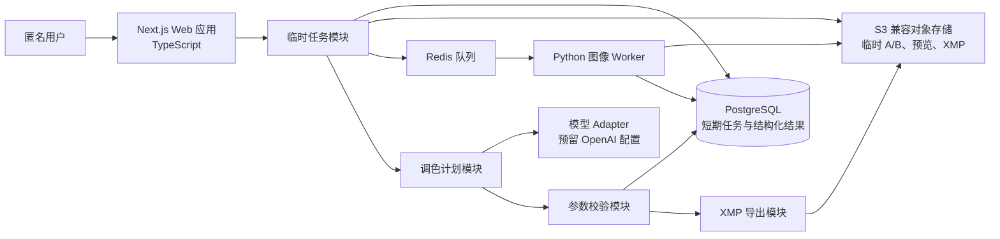
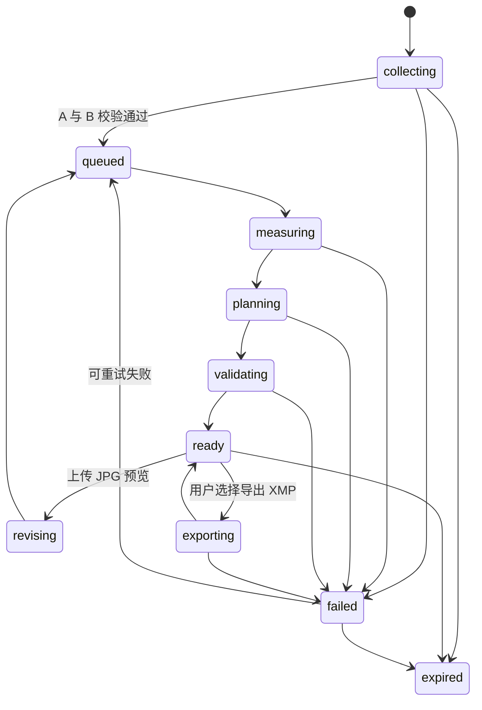

# RefTone 调色分析 MVP 架构

## 1. 架构目标与约束

RefTone 将参考图 A 的可迁移视觉特征转化为目标图 B 的、可解释且可手动执行的 Lightroom 参数计划。MVP 的核心路径是：

`上传参考图 A + 目标图 B → 风格分析 → Lightroom 参数计划 → 用户手动调整`

XMP 是已校验参数计划的可选导出，不是核心路径的前置条件。用户无需登录；任务、原图和可识别 EXIF 都是临时数据，不建立偏好档案、任务历史或跨任务个性化。

架构遵循以下原则：

- 使用模块化单体，不拆分微服务。
- 模型只负责风格理解、参数草案和解释；图像测量、差异计算、参数安全约束、XMP 生成和清理均为确定性程序。
- 已校验参数计划是结果展示、可选 XMP 导出和二次微调的唯一事实来源。
- 每个模块提供小而深的接口，将基础设施、格式兼容、重试和风险规则隐藏在实现内部。
- 原始资产和可识别信息默认短期保存，并由独立清理流程保证删除。

## 2. 运行形态

系统由一个 Web 应用和一个图像 Worker 构成；PostgreSQL、Redis 与 S3 兼容对象存储是基础设施 Adapter，不是独立业务服务。

### 技术选型

| 范围 | 选择 | 理由 |
| --- | --- | --- |
| Web 与 BFF | Next.js + TypeScript | 以单一可部署单元承载界面、匿名会话、上传授权、任务编排和结果读取。 |
| 图像计算 | Python Worker | 适合 RAW、EXIF、直方图、色板、HSL 与图像解码等处理。 |
| 短期状态 | PostgreSQL | 保存任务状态、测量结果、已校验计划、轮次与清理记录。 |
| 异步作业 | Redis 队列 | 承担分析、导出、清理、重试与超时控制。 |
| 二进制资产 | S3 兼容对象存储 | 保存有 TTL 的上传图、预览图与可下载 XMP。 |
| 本地运行 | Docker Compose | 一次启动 Web、Worker、PostgreSQL、Redis 与对象存储；生产可替换为托管 Adapter。 |
| 模型接入 | 模型 Adapter | 模型标识、提示词版本和凭证由配置注入；当前只预留位置，不创建密钥或发起请求。 |

## 3. 模块与接口

业务模块以接口为测试与调用表面；调用方不依赖其内部使用的数据库、队列、图像库或模型 SDK。

| 模块 | 对外接口 | 隐藏的实现复杂度 |
| --- | --- | --- |
| 临时任务模块 | 创建任务、附加资产、查询任务、请求重试、结束任务 | 匿名会话关联、状态迁移、资源归属、幂等键与过期时间。 |
| 上传模块 | 签发受限上传、确认资产可用 | 格式/大小校验、对象键隔离、MIME 限制、可解码性检查。 |
| 图像分析模块 | `analyze(asset)` 返回测量结果 | RAW/EXIF 解读、直方图、色板、HSL、对比度、裁切风险、动态范围线索。 |
| 风格与差异模块 | `compare(reference, target)` 返回风格上下文与匹配限制 | 可迁移性判断、明暗/色彩差异的确定性计算。 |
| 调色计划模块 | `propose(context)` 返回结构化草案 | 模型调用、提示词版本、响应 Schema 校验与可展示解释。 |
| 参数校验模块 | `validate(draft, risks)` 返回已校验计划或拒绝原因 | Lightroom 数值边界、RAW/JPEG 差异、裁切/肤色等风险收紧规则。 |
| XMP 导出模块 | `export(validatedPlan)` 返回临时下载资产 | XMP 序列化、允许字段白名单、文件存储和下载过期时间。 |
| 二次微调模块 | `revise(previousPlan, preview)` 返回新计划 | 上一轮上下文关联、预览测量与增量建议。 |
| 清理模块 | `expire(task)` 完成临时数据删除 | 队列调度、对象删除、数据库清理、失败重试与告警。 |

### 关键不变量

- 计划模块不能绕过参数校验模块；只有“已校验计划”可被 UI、XMP 导出或二次微调消费。
- XMP 模块不能接收模型自由文本，只接收允许字段已固定的已校验计划。
- 图像 Worker 不能解释审美或直接写入用户可见建议；它只产出确定性测量结果。
- 浏览器不能进行参数校验、XMP 生成或删除资产。
- 所有临时资产必须能经任务与匿名会话验证归属；不得仅凭客户端传入的资产标识授权。

## 4. 任务流与状态

每次分析固定对应一张 A 和一张 B。分析与清理通过队列异步执行，上传请求不会被图像测量或模型请求阻塞。

1. Web 应用创建匿名临时任务，并为 A、B 签发受限上传授权。
2. 上传模块确认格式、大小和可解码性；有效资产使任务进入 `queued`。
3. Python Worker 测量 A、B，写入确定性测量结果后进入 `planning`。
4. 风格与差异模块构建规划上下文；调色计划模块产出结构化草案。
5. 参数校验模块收紧、接受或拒绝草案。成功后任务进入 `ready`，Web 仅展示此计划。
6. 用户在 `ready` 状态手动调整，或可选地请求 XMP。导出完成或失败后都返回 `ready`，不影响参数卡。
7. 用户上传调整后的 JPG 预览图时，以同一临时任务创建新轮次，复用上一份已校验计划并重复分析流程。
8. 会话结束、任务过期或明确结束时，清理模块删除临时数据并转入 `expired`。

## 5. 数据与生命周期

PostgreSQL 只保存临时任务和结构化结果。A、B、预览图和 XMP 文件只存对象存储，并与明确的 TTL 关联。

| 数据 | 存储位置 | 生命周期 |
| --- | --- | --- |
| 匿名会话与任务状态 | PostgreSQL | 临时会话有效期内；到期后删除。 |
| 上传原图和 JPG 预览 | 对象存储 | 处理完成、失败或会话到期后由清理任务删除。 |
| 可识别 EXIF | PostgreSQL 或受限测量记录 | 仅在本次分析需要时保存，随后删除。 |
| 非识别性测量结果 | PostgreSQL | 仅随临时任务保留，用于展示和本会话微调。 |
| 已校验参数计划 | PostgreSQL | 仅随临时任务保留，是 XMP 和微调的唯一输入。 |
| XMP | 对象存储 | 用户显式导出后以短期下载 TTL 保存。 |

MVP 不保存用户账户、审美偏好、场景档案、历史任务、长期报告或跨任务训练数据。

## 6. 可靠性、安全与可观测性

- 每个异步作业带任务 ID、轮次和输入资产哈希构成的幂等键，避免重复执行产生互相覆盖的结果。
- 上传校验、图像测量、模型调用、参数校验、XMP 导出和清理均记录开始时间、结束时间、状态和可安全展示的错误码。
- 队列任务有超时、有限重试和死信处理；清理任务的失败必须可重试并触发告警。
- 错误必须精确指出失败阶段，并保留已经完成的可用结果；尤其 XMP 失败不能删除或隐藏参数计划。
- 上传授权限制 MIME、大小、有效期和对象键前缀；对象存储只允许受控服务访问原始资产。
- 模型 Adapter 只接收脱敏后的测量结果和任务上下文，不接收原始文件二进制。模型、提示词与 Schema 版本显式记录；密钥只能由环境变量或受管密钥机制提供。

## 7. 验证策略

最高层测试缝隙是参数计划模块的端到端行为：

`提交有效 A/B → 获得已校验参数计划，或获得明确的匹配限制`

围绕这一缝隙验证：

- 已知色彩与明暗差异样图对得到方向正确、顺序正确、带范围/理由/风险的计划。
- RAW 与 JPEG 的调整范围和风险提示存在可测试差异。
- 不支持、过大或无法解码的上传得到可恢复错误。
- 高光裁切、肤色风险、低光和明显不匹配素材得到受限计划或明确拒绝，不伪装成精确建议。
- XMP 只能从已校验计划导出，内容只含允许的全局项目；导出失败时参数计划仍然可用。
- 二次微调使用上一轮已校验计划与新的 JPG 预览，不创建持久化偏好或历史。
- 临时会话到期、分析失败和显式结束都会触发资产与可识别 EXIF 的可重试清理。

## 8. 范围外事项

- 账户、邮箱登录、长期项目、保存报告、个人偏好、场景档案、版本历史与跨任务个性化。
- 自动生成或改写最终照片、批量处理、多参考图混合、网页/社媒导入和自动抓图。
- 局部蒙版、裁切、镜头校正、修复等目标专属 XMP 设置。
- 非 Lightroom 编辑器的等值参数映射。
